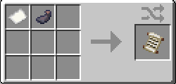
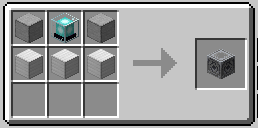
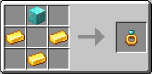

# Королевства 👑

Система королевств позволяет группе игроков основать государство: занять территорию,
получить общий приват, защиту и уникальные бонусы за содержание.

---

## Создание королевства

### Шаг 1. Хартия

Скрафтите **Хартию королевства** (бумага + чернильный мешок) и подпишите её (ПКМ →
ввод названия). Подписавший становится **королём**.

!!! warning "Требования к будущему королю"
    Подписать хартию может только игрок, который:

    - имеет хотя бы **один навык 10 уровня** (максимальный);
    - имеет ещё **два навыка 5+ уровня** (максимальный не считается);
    - имеет **суммарный уровень всех навыков ≥ 25**.

### Шаг 2. Поддержка

Король передаёт хартию двум другим игрокам — каждый подписывает её в поддержку (ПКМ).
Нужно **2 подписи**. Игрок, подписывающий хартию, не должен состоять в королевстве.

### Шаг 3. Блок королевства

Скрафтите и установите **Блок королевства**.

!!! info "Правила установки"
    - Над блоком должно быть **открытое небо** (как у маяка) — никаких блоков выше.
    - Ставить блоки над активным блоком королевства нельзя.

### Шаг 4. Основание

Король кладёт подписанную хартию в слот блока (положить может только король) → выбирает
**цвет королевства** → кнопка «Основать». Все подписавшие хартию должны быть онлайн.

Чанк с блоком становится центром, вокруг присоединяется область **5×5 = 25 чанков**.

---

## Рецепты

**Хартия королевства** — бумага + чернильный мешок (без формы).

{ width="360" }

**Блок королевства** — гладкий камень, маяк, блок железа.

{ width="360" }

**Кольцо лорда** — блок алмаза, золотые слитки.

{ width="360" }

---

## Территория

- **Расширение** — предметом **Кольцо лорда** (ПКМ по свободному чанку, прилегающему по
  грани к территории королевства). Крафтит кольцо только король, использует любой житель.
- Чанки королевства приватятся автоматически (через FTB Chunks) — общий доступ для всех
  жителей. Ручной приват чанков и создание команд игрокам недоступны.
- Центральный чанк всегда прогружен (force-load) — королевство «живёт» даже без игроков.

### PvP на территории

На территории королевства действует особый режим:

- житель королевства может атаковать **чужаков** (не-жителей) на своей земле;
- чужак **не может** бить жителей, пока его не ударит кто-то из них — после этого может
  отвечать;
- при выходе из чанков королевства режим сбрасывается.

При входе на чужую территорию выводится предупреждение.

---

## Меню (клавиша K)

- Вкладка **Прокачка** — пути и специализации.
- Вкладка **Королевство** (для жителей) — название, король, чанки, шкалы характеристик,
  активные эффекты и список жителей.
- Вкладка **Управление королевством** (только король):
    - **Жители** — список с изгнанием;
    - **Управление** — приглашение игрока по нику (с автоподбором) и смена цвета.

### Приглашения

Король приглашает игрока по нику. Приглашённый получает сообщение в чате с кнопками
**Принять** / **Отклонить**. Нельзя пригласить игрока, уже состоящего в королевстве.

---

## Содержание королевства (Upkeep)

Королевство поддерживается тремя характеристиками. Каждая — от **0 до 1000**, старт **500**.
Если любая достигнет **0** — королевство распадётся.

Ресурсы кладутся в специальные слоты блока королевства (класть может любой житель, забирать —
только король). Слот вмещает до 512 предметов и работает как буфер: предмет поглощается в
характеристику, когда в ней есть место.

| Характеристика | Что кладётся | Ценность |
|---|---|---|
| **Продовольствие** | любая еда (кроме отравляющей) | по сытности, хлеб = 1 |
| **Материалы** | дерево / камень | дерево 0.5, камень 0.2 |
| **Довольствие** | самоцветы (`c:gems`) | изумруд 1, алмаз 3, прочие 0.5 |

### Расход

Раз в **период** (~20 минут реального времени, 24000 игровых тиков) королевство
списывает с каждой характеристики:

| Характеристика | Формула за период | Множитель |
|---|---|---|
| Продовольствие | `жители × 0.77` | 0.77 за жителя |
| Материалы | `чанки × 0.093` | 0.093 за чанк |
| Довольствие | `Σуровней жителей × 0.046` | 0.046 за уровень |

Где:

- **жители** — число участников королевства;
- **чанки** — размер территории (число заклеймленных чанков, старт 25);
- **Σуровней жителей** — сумма суммарных уровней навыков всех жителей.

Пример для дефолта (3 жителя, 25 чанков, Σуровней ≈ 50):

- Продовольствие: `3 × 0.77 = 2.31` за период;
- Материалы: `25 × 0.093 = 2.33` за период;
- Довольствие: `50 × 0.046 = 2.30` за период.

В сутках реального времени 72 периода (24 ч ÷ 20 мин). Полный запас (1000) при этом расходе
хватает примерно на 6 реальных дней, половина (500) — около **3 реальных дней** без пополнения.

### Баффы и дебаффы

Каждая характеристика даёт жителям эффект: **бафф при значении > 50%**, **дебафф при < 50%**.
Сила меняется каждые 10% (100 очков) от середины, максимум 5 ступеней.

| Характеристика | Эффект за ступень (±10%) | Максимум (100% / 0%) |
|---|---|---|
| **Продовольствие** | ±1 ХП, ∓5% расхода голода | +5 ХП, −25% голода |
| **Материалы** | ±5% скорости добычи | ±25% |
| **Довольствие** | ±5% опыта, ±0.5 удачи | ±25% опыта, ±2.5 удачи |

Эффекты складываются с другими бонусами (свои и модов), не перезаписывая их. Активные
эффекты показаны на вкладке «Королевство» (зелёным — баффы, красным — дебаффы).

---

## Роспуск

Королевство распадается, если:

- любая характеристика достигла 0;
- блок королевства уничтожен оператором / внешними средствами.

При роспуске снимается приват чанков, распускается команда, снимаются баффы жителей.
Активный блок королевства нельзя сломать обычным способом.
